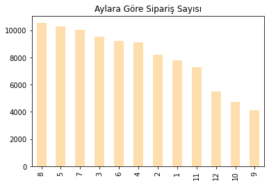
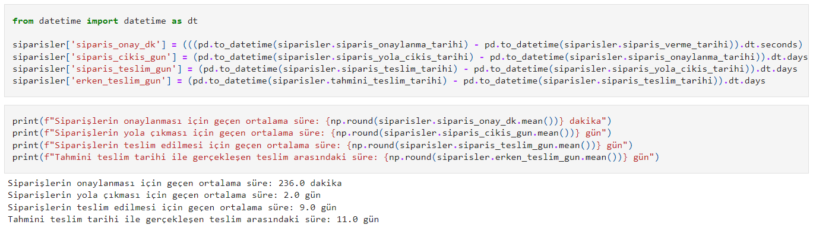

# 🛍️ E-Ticaret Veri Seti 🛒

## Veri Seti Hikayesi 📖

9 farklı veri setimiz bulunmaktadır. Bunlar:

**1. customer_data:** Müşteriler hakkında bilgi verir.

| Değişken Adı | Açıklama |
| ----------------- | ----------- |
| musteri_id        | Her siparişin kendine özel musteri_id değeri bulunur. |
| musteri_essiz_id | Müşterilere özel tanımlanan eşsiz id değeri. |
| musteri_posta_kodu | Müşteri posta kodunun ilk beş hanesini içerir. |
| musteri_sehir | Müşteriye ait şehir bilgisi. |
| musteri_eyalet | Müşteriye ait eyalet bilgisi. |

**2. geolocation_data:** Konuma ait bilgiler taşımaktadır.

| Değişken Adı | Açıklama |
| ----------------- | ----------- |
| cografi_id       | Posta kodunun ilk beş hanesini içerir. |
| enlem | Konuma ait enlem değeri. |
| boylam | Konuma ait boylam değeri. |
| sehir | Konuma ait şehir bilgisi. |
| eyalet | Konuma ait eyalet bilgisi. |

**3. items_data:** Siparişe ait bilgiler verir.

| Değişken Adı | Açıklama |
| ----------------- | ----------- |
| siparis_id | Siparişe ait eşşiz id değeri. |
| siparis_adet | Siparişteki ürün adetini içerir. |
| urun_id | Sipariş edilen ürüne ait id bilgisi. |
| satici_id | Satıcıya ait id bilgisi. |
| nakliye_son_tarih | Sipariş edilen ürünün sevkiyatının tamamlanması gereken tarih. |
| urun_fiyat | Sipariş edilen ürünlerin gerçek fiyatı. |
| nakliye_ucreti | Nakliye ücreti. |

**4. payments_data:** Ödemeye ait bilgiler verir.

| Değişken Adı | Açıklama |
| ----------------- | ----------- |
| siparis_id | Siparişe ait eşşiz id değeri. |
| odeme_seq | Yapılan ödeme sıralaması. |
| odeme_sekli | Kullanılan ödemenin şekli. |
| taksit_sayisi | Yapılan taksit sayısı. |
| odeme_degeri | Sipariş için ödenen toplam tutar. |

**5. reviews_data - yorumlar:** Alışveriş deneyimi hakkında incelemeler içerir.

| Değişken Adı | Açıklama |
| ----------------- | ----------- |
| yorum_id | Sipariş edilen ürüne yapılan yoruma ait id değeri. |
| siparis_id | Siparişe ait eşşiz id değeri. |
| yorum_puan | 1-5 ölçeğinde, müşteri tarafından verilen inceleme puanı. |
| yorum_olusturma_tarihi | Yapılan yoruma ait tarih bilgisi. |
| yoruma_donus_tarihi | Verilen yanıta ait zaman bilgisi. |

**6. orders_data - siparisler:** Siparişe ait bilgiler verir.

| Değişken Adı | Açıklama |
| ----------------- | ----------- |
| siparis_id | Siparişe ait eşşiz id değeri. |
| musteri_id | Müşteriye ait eşşiz id değeri. |
| siparis_durumu | Sipariş durumuna ait bilgi. |
| siparis_verme_tarihi | Satın almaya ait tarih bilgisi. |
| siparis_onaylanma_tarihi | Sipariş onayına ait zaman bilgisi. |
| siparis_yola_cikis_tarihi | Siparişin çıkışına ait zaman bilgisi. |
| siparis_teslim_tarihi | Sipariş teslimine ait zaman bilgisi. |
| tahmini_teslim_tarihi | satın alma anında müşteriye bildirilen tahmini teslim tarihini gösterir. |

**7. translations_data:** Ürün kategorisine ait Portekizce ve İngilizce bilgi içerir.

| Değişken Adı | Açıklama |
| ----------------- | ----------- |
| urun_kategori_pt | Ürüne ait Portekizce kategori adı. |
| urun_kategori_en | Ürüne ait İngilizce kategori adı. |

**8. products_data:** Ürünlere ait bilgiler verir.

| Değişken Adı | Açıklama |
| ----------------- | ----------- |
| urun_id | Siparişe edilen ürüne yapılan yoruma ait id değeri. |
| urun_kategori_pt | Siparişe ait eşşiz id değeri. |
| urun_adi_uzunluk | Ürün adına ait karakter sayısı. |
| urun_aciklama_uzunluk | Ürün açıklamasına ait karakter sayısı. |
| urun_fotograf_sayisi | Yayınlanan ürün fotoğraf sayısı. |
| urun_agirlik_gram | Gram cinsinden ölçülen ürün ağırlığı. |
| urun_uzunluk_cm | Santimetre cinsinden ölçülen ürün uzunluğu. |
| urun_yukseklik_cm  | Santimetre cinsinden ölçülen ürün yüksekliği. |
| urun_genislik_cm  | Santimetre cinsinden ölçülen ürün genişliği. |

**9. sellers_data:** Satıcıya ait bilgiler verir.

| Değişken Adı | Açıklama |
| ----------------- | ----------- |
| satici_id | Satıcıya ait id bilgisi. |
| satici_posta_kodu | Satıcıya ait posta kodunun ilk 5 hanesi. |
| satici_sehir | Satıcıya ait şehir bilgisi. |
| satici_eyalet | Satıcıya ait eyalet bilgisi. |

## Kullanılan Kütüphaneler 📚

* NumPy
* Matplotlib
* Pandas
* Seaborn
* warnings

## Yapılan Analizlerden Kesitler 🔍

* Aylara Göre Sipariş Sayısı

* Siparişlerin Dağılımı

* En Çok Alışveriş Yapan 10 Müşteri

* Siparişlerle İlgili Analizler

**Daha fazla detaya erişebilmek için analizler.ipynb isimli dosyayı inceleyebilirsiniz. 🪄**